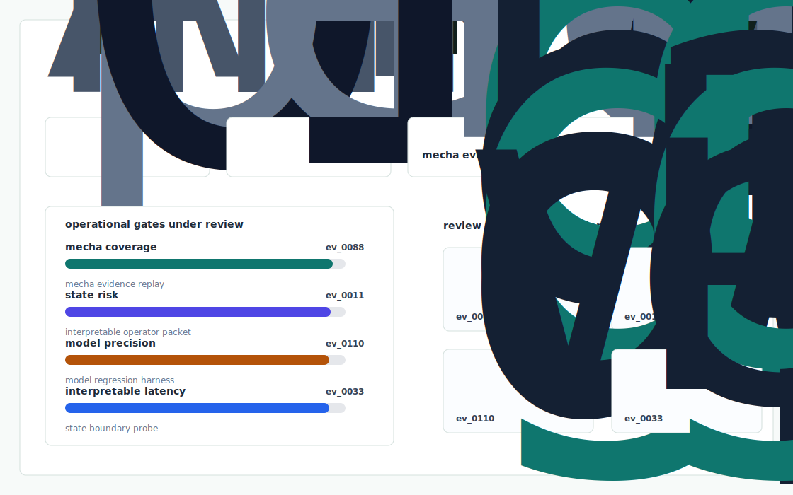
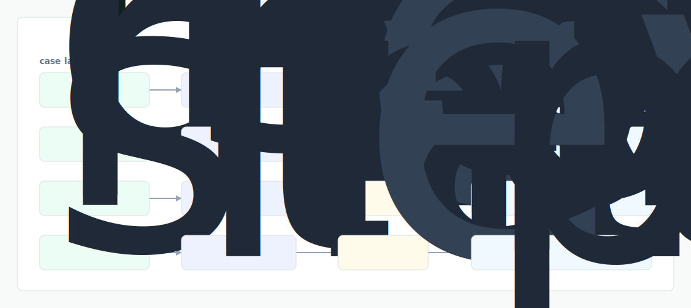

# Mecha Trace

A feature attributed report review SDK and viewer: every sentence in a Mecha draft links to a named SAE feature, a saliency overlay on the image, and a one click accept/reject that re renders the report and writes an audit row to a verifiable log.



## Why it exists

Mecha has a state of the art model and 17,000 interpretable features (interpretability blog), but the AmeriRad rollout will not be gated on CheXbert F1 — it will be gated on PACS/DICOM ingestion at line rate and HL7 report write back without surprises, which is the load bearing operational layer they have not yet publicly shown. More importantly: when a.

The project is intentionally built as a local replay harness instead of a slide. It creates fixtures, plants realistic failure modes, produces citation-locked evidence, and turns the result into a dashboard a reviewer can inspect without credentials or hosted services.

## What is inside

- Deterministic fixture generation for the company-specific risk surface.
- Strategy code in `src/mecha_trace/strategy.py` with project-specific scoring and visual evidence.
- Citation-locked reports where every decision claim points to a generated evidence ID.
- Two regenerated visual artifacts: `outputs/project_working.svg` and `outputs/evidence_map.svg`.
- A portable demo pack with JSON, CSV, Markdown, HTML, SVG, benchmark, and test artifacts.



## Signals it measures

- `mecha coverage`
- `state risk`
- `model precision`
- `interpretable latency`

## Failure modes it plants

- mecha drift
- state gap
- model misroute
- interpretable blindspot

## Run it locally

```bash
uv sync
uv run mecha-trace all
uv run pytest -q
uv run ruff check .
```

## Outputs worth opening

- `outputs/dashboard.html`
- `outputs/project_working.svg`
- `outputs/evidence_map.svg`
- `outputs/operator_brief.md`
- `outputs/decision_report.md`
- `outputs/strategy_model.json`
- `outputs/demo_pack.zip`

## Sources

- https://www.ycombinator.com/launches/MeX-mecha-health-trustworthy-medical-image-reporting-using-ai
- https://www.mecha-health.ai/blog/Mecha-net-v0.1
- https://www.mecha-health.ai/blog/Interpreting-a-radiological-foundation-model
- https://www.mecha-health.ai/about-us
- https://radiologybusiness.com/press-release/mecha-health-raises-41m-seed-round-build-next-generation-foundation-models-radiology
- https://americanradiologysolutions.com/blog/amerirad-partners-with-mecha-health/
- https://arxiv.org/abs/2410.03334
- https://ucl-pond.github.io/author/ahmed-abdulaal-abdulaal/
- https://www.menlotimes.com/post/mecha-health-raises-4-1-million-seed-round-to-build-next-generation-foundation-models-for-radiology

## Boundary

Everything runs locally against synthetic fixtures. There are no credentials, no customer records, no outreach files, and no hosted API dependency.
